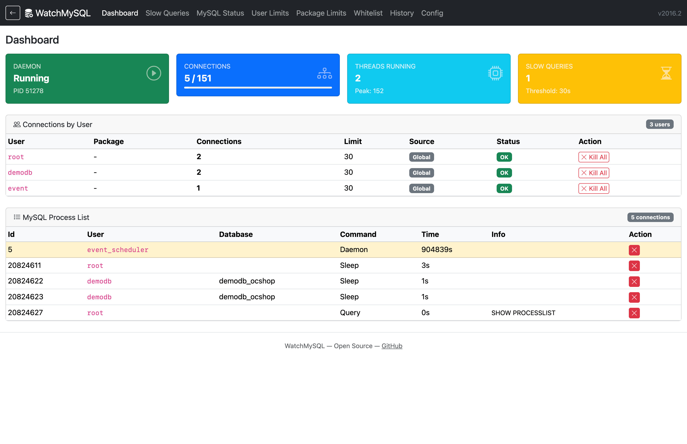

# WatchMySQL

A cPanel/WHM plugin that monitors MySQL concurrent connections per user and enforces configurable limits. When a user exceeds their limit, WatchMySQL can automatically kill their connections and send email alerts.



## Features

- **Real-time Dashboard** -- daemon status, connection metrics, per-user summary with color-coded status
- **MySQL Process List** -- view and kill active connections with one click
- **Slow Query Monitor** -- dedicated page for long-running queries above a configurable threshold
- **MySQL Server Status** -- key metrics, connection headroom, query statistics
- **Per-User Limits** -- override global limits for specific users, with effective limit visibility
- **Per-Package Limits** -- set limits based on cPanel hosting packages
- **User Whitelist** -- exempt backup/monitoring users from enforcement
- **Email Notifications** -- alert admins and users when limits are exceeded, with a test button
- **Connection History** -- log of all kill/alert events with filtering
- **Auto-Upgrades** -- checks GitHub Releases for new versions

## Requirements

- cPanel/WHM server (CentOS/RHEL/AlmaLinux/CloudLinux)
- Perl with `DBI` and `DBD::mysql` modules
- PHP 7.x or 8.x
- MySQL or MariaDB

## Installation

```bash
cd /usr/src
git clone https://github.com/konstantinosbotonakis/watchmysql.git
cd watchmysql
bash install
```

The installer will:
- Copy the daemon to `/usr/sbin/watchmysql`
- Install the WHM plugin UI
- Set up the init script and chkservd monitoring
- Register with cPanel's appconfig
- Install required Perl modules if missing

## Upgrading

The plugin can upgrade itself from GitHub Releases:

```bash
/var/cpanel/addons/watchmysql/bin/upgrade
```

Or from WHM: navigate to **WatchMySQL > Config** and check for available upgrades.

If `automatic_updates` is enabled in the config, the daemon will check nightly.

## Configuration

The daemon reads from `/etc/watchmysql.config`:

| Setting | Default | Description |
|---------|---------|-------------|
| `connection_limit` | `10` | Global max connections per user (0 = disabled) |
| `check_interval` | `900` | Seconds between checks (min 300) |
| `kill_connections` | `1` | Kill connections when limit exceeded |
| `notify_admin` | `1` | Email admin on violations |
| `notify_user` | `1` | Email user on violations |
| `slow_query_threshold` | `30` | Seconds before a query is flagged as slow |
| `automatic_updates` | `1` | Check for updates nightly |

**Limit priority order:** Per-user limit > Package limit > Global limit

Additional config files:
- `/etc/watchmysql.userlimits` -- per-user overrides (`username=limit`)
- `/etc/watchmysql.packagelimits` -- per-package overrides (`package=limit`)
- `/etc/watchmysql.whitelist` -- exempt users (one per line)

## Local Development

You can run the PHP UI locally without a cPanel server:

```bash
cd whmplugin
touch DEV_MODE
php -S localhost:8080
```

Open `http://localhost:8080/index.php`. Dev mode uses mock cPanel data from the `dev/` directory and connects to your local MySQL. Edit `dev/.my.cnf` with your local credentials.

## Uninstalling

```bash
/var/cpanel/addons/watchmysql/bin/uninstall
```

## Architecture

```
watchmysql           # Perl daemon (runs as root, polls SHOW PROCESSLIST)
install / uninstall  # Shell scripts for cPanel integration
upgrade              # Upgrade from GitHub Releases
whmplugin/           # PHP WHM admin UI
  watchmysql.class.php  # Core PHP class (MySQL queries, config, limits)
  env.php               # Dev mode detection
  header.php / footer.php / alerts.php  # Shared layout (Bootstrap 5)
  index.php             # Dashboard + process list
  slowqueries.php       # Slow query monitor
  status.php            # MySQL server status
  userlimits.php        # User limit management
  packagelimits.php     # Package limit management
  whitelist.php         # Whitelist management
  history.php           # Connection history log
  globalconfig.php      # Global configuration
  dev/                  # Mock data for local development
```

## History

This project originated as a fork of the WatchMySQL plugin by [NDCHost](https://www.ndchost.com/), which was last actively maintained around 2014-2020. The original plugin stopped receiving updates, so this fork was created initially to fix PHP 7.x compatibility. It has since been rewritten with a modern UI (Bootstrap 5), PHP 8.x support, local development mode, and many new monitoring features.

## License

This project is licensed under the MIT License. See [LICENSE](LICENSE) for details.
